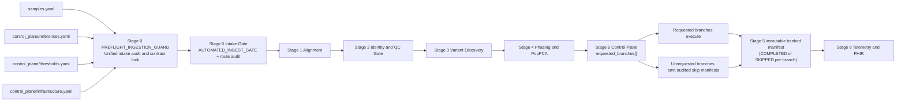

⚠️ **CLINICAL PIPELINE UNDER CONSTRUCTION & ACTIVE REFACTORING** ⚠️
*Notice: This pipeline is currently undergoing a major architectural refactor to enforce CAP/CLIA zero-loss data provenance and strict branch isolation. Upstream stages (1-3) are being cryptographically locked, and Stage 5 is being severed into isolated clinical domains (Germline, PGx, SF, PRS, Somatic). Do not use for production runs until this notice is removed.*

# nf_Gen_Var_Pipe

## Status

This repository contains a production-grade, stage-scoped Nextflow DSL2 clinical WES pipeline with fail-closed governance, externalized control planes, and signed downstream reporting artifacts.

## Governance & Control Plane

This repository now uses a centralized control plane under control_plane/ for immutable clinical policy and reference contracts.

- control_plane/references.yaml defines governed reference assets and index paths.
- control_plane/thresholds.yaml defines clinical thresholds and stage-specific operating limits.
- control_plane/infrastructure.yaml defines resource policy and execution profiles.

The execution model is hub-and-spoke:

- The root pipeline orchestrates multi-stage clinical flow.
- Each stage can also run independently from its own directory.
- Spoke stages resolve shared governance via ${projectDir}/../control_plane/.
- This preserves a single source of truth for clinical rules while supporting stage-local debugging.

## What This Repository Contains

`nf_Gen_Var_Pipe` is a staged WES processing framework organized into independent gates from intake through reporting.

Current top-level stages:

- `Stage_0_Preflight_Ingest_Gate`
- `Stage_1_Alignment_Read_Processing`
- `Stage_2_PostAlign_Sample_Validation_Gate`
- `Stage_3_Variant_Discovery_Engine`
- `Stage_4_Ancestry_Phasing_Highway`
- `Stage_5_Clinical_Annotation_PGx_Triage`
- `Stage_6_Clinical_Reporting_Workbench_Gateway`

## Stage Overview (Clinical Path 1 to 6)

The production clinical execution path is:

| Stage | Clinical Function | Primary Governance Token |
|---|---|---|
| Stage 1 | Alignment + coordinate normalization + identity verification | `VALID_PASS|ALIGNMENT_COMPLETED` |
| Stage 2 | Identity/contamination/sex/purity gate | `VALID_PASS|SAMPLE_VALIDATED` |
| Stage 3 | Variant discovery + normalization + schema validation | `VALID_PASS|VARIANTS_HARMONIZED` |
| Stage 4 | Phasing + ancestry projection | `VALID_PASS|VARIANTS_HARMONIZED` passthrough |
| Stage 5 | Clinical triage and signed bundle creation | Stage 5 signed bundle + provenance |
| Stage 6 | Zero-loss integrity + workbench + FHIR + telemetry sinks | Stage 6 banked manifest |

Stage 0 remains the intake/preflight control gate that validates incoming manifests and route decisions before Stage 1.

## Clinical Passport & Schema Standardization

Sample manifests now follow a single canonical schema standard:

- Semantic versioning: 1.0.0
- Canonical field names: reported_sex, sequencing_platform, read_file_paths.read1/2, mapped_bam
- Pure YAML only; no JSON-in-YAML manifests
- Centralized manifest templates live under control_plane/manifest_templates/

Master templates:

- intake_template.yaml: Stage 0 fresh FASTQ intake contract
- banked_template_stage1_plus.yaml: cumulative aligned/variant handoff
- mini_control_template.yaml: unified manual debugging manifest with stage-skipping lookahead blocks

## September 2026 Compliance Update

Stage 5 now enforces immutable, fail-closed branch routing from the sample manifest control plane.

- `requested_branches` is mandatory per sample and must be a non-duplicate list of recognized branch identifiers.
- Missing/malformed/unknown branch directives fail hard with non-zero exit (`STAGE5_CONTROL_PLANE_FAILURE`).
- Unrequested branches do not execute compute; they emit explicit audited skip manifests (`SKIPPED_BY_CLINICAL_DIRECTIVE`).
- Requested branches are explicitly annotated as `COMPLETED` and included in immutable Stage 5 banked manifest provenance.
- Stage 6 continues from a complete five-branch Stage 5 manifest set where each branch is explicitly `COMPLETED` or `SKIPPED_BY_CLINICAL_DIRECTIVE`.

## System Architecture and Scope



### Stage 1: Alignment Read Processing

Purpose:
- Platform-aware intake routing and alignment/markdup processing.
- Coordinate normalization and cross-sample identity checks.
- Stage 1 banked contract generation for Stage 2.

### Stage 2: Post-Align Sample Validation Gate

Purpose:
- Verify contamination, chromosomal sex concordance, and purity coherence.
- Enforce fail-closed sample-level acceptance before discovery.
- Emit `sample_qc_meta` and Stage 2 banked contract.

### Stage 3: Variant Discovery Engine

Purpose:
- Compute branch-aware variant artifacts.
- Calibrate filtering using Stage 2 purity/contamination metrics.
- Normalize and validate VCF against GA4GH/VCF 4.2 production schema.

### Stage 4: Ancestry Phasing Highway

Purpose:
- Run ancestry projection and read-backed phasing handoff.
- Produce phased assets and Stage 4 banked contract for clinical triage.

### Stage 5: Clinical Annotation + PGx Triage

Purpose:
- Execute parallel clinical triage channels.
- Create signed `clinical_bundle.tar.gz` and provenance payload.
- Bank Stage 5 outputs for reporting gateway.

### Stage 6: Clinical Reporting Workbench Gateway

Purpose:
- Enforce zero-loss ledger checks and fail-closed reporting preconditions.
- Build Medical Director workbench payloads and FHIR/HTML/PDF outputs.
- Emit dual telemetry sinks (`provenance` and lab metrics) and Stage 6 banked manifest.

## Externalized Control Planes

Pipeline control is intentionally externalized and environment-driven.

| Control Plane | Source | Notes |
|---|---|---|
| Reference root | `params.ref_data_root` / `params.ref_dir` | Defaults to `NXF_REF_DATA_ROOT` then local assets fallback. |
| PKI key directory | `params.pki_key_dir` | Defaults to `NXF_PKI_KEY_DIR` then `${projectDir}/keys`. |
| Resources and retry policy | `nextflow.config` `process {}` | Label-based CPU/memory scaling with bounded retries on OOM-like exits. |
| Parameter contracts | `control_plane/` and `assets/` | Immutable references, thresholds, schemas, and sample manifests are declarative artifacts. |
| Work/temp roots | `params.work_root`, `params.tmp_dir` | Defaulted to scratch paths for high-throughput execution. |

Audit and LIMS readiness:

- Runtime outputs are routed into flat sample-specific directories such as tests/<sample_id>/.
- Compliance evidence is consolidated under audit_and_qc/ for stage-local and downstream audit replay.
- This layout keeps artifacts separable by sample while preserving deterministic lineage.

Key runtime conventions:
- Reference data is mounted through Docker/Apptainer profile mount options.
- Resource tiers are label-driven (`process_low`, `process_medium`, `process_high`, `process_high_memory`).
- Fail-closed process policy defaults to retry only for selected infrastructure exits.

## Whole-Pipeline Infrastructure Allocation

Infrastructure-aware allocation now applies at the orchestrator level (Stages 0-6), not only within Stage 3.

Primary control surface:
- `control_plane/infrastructure.yaml` -> `pipeline_execution`

Key fields:
- `local_system.total_cpus`, `local_system.total_memory_gb`
- `local_system.reserve_cpus`, `local_system.reserve_memory_gb`
- `profile_selection_mode` (`auto` or `manual`)
- `active_profile` (used in manual mode)
- `auto_thresholds.small_max_available_cpus`, `auto_thresholds.medium_max_available_cpus`
- `profiles.small|medium|large` (`max_cpus`, `max_memory_gb`)

Resolution behavior:
- `auto` mode computes available resources (`total - reserve`) and selects `small`/`medium`/`large` by thresholds.
- `manual` mode uses `active_profile`.
- CLI `--execution_profile <profile>` overrides policy selection.
- CLI `--max_cpus`, `--max_memory_gb`, `--max_memory` override resolved values.

Operational outcome:
- Low-core systems naturally reduce global task parallelism.
- High-core systems scale throughput while remaining bounded by policy.
- Resolved policy is emitted in orchestrator logs (`PIPELINE_INFRA: ...`) for audit traceability.

## Stage 3 Infrastructure Allocation

Stage 3 now resolves branch allocation from the governed infrastructure contract rather than fixed host assumptions.

Primary control surface:
- `control_plane/infrastructure.yaml` -> `stage3_variant_discovery`
- If `stage3_variant_discovery.local_system` is omitted, Stage 3 inherits `pipeline_execution.local_system`.

Key fields:
- `local_system.total_cpus`, `local_system.total_memory_gb`
- `local_system.reserve_cpus`, `local_system.reserve_memory_gb`
- `profile_selection_mode` (`auto` or `manual`)
- `active_profile` (used in manual mode)
- `auto_thresholds.small_max_available_cpus`, `auto_thresholds.medium_max_available_cpus`
- `profiles.small|medium|large` (`variant_heavy_cpus`, `process_medium_cpus`, memory envelopes, `max_parallel_branches`)

Resolution behavior:
- `auto` mode computes available resources (`total - reserve`) and selects `small`/`medium`/`large` by thresholds.
- `manual` mode uses `active_profile`.
- CLI `--infrastructure_profile <profile>` overrides both.
- Branch-specific CPU flags (for example `--stage3_cnv_cpus`) still override profile defaults.

Operational outcome:
- Low-core systems naturally downshift branch concurrency.
- High-core systems scale to broader parallel execution.
- Resolved policy is emitted in Stage 3 logs (`STAGE3_INFRA: ...`) for audit traceability.

## Cryptographic Integrity and Telemetry

Stage 5 and Stage 6 implement signed artifact lineage and telemetry sinks.

### RS256 Signing and Bundle Provenance

- Stage 5 packages a `clinical_bundle.tar.gz` and computes SHA-256 digests.
- A digital signature block is written in Stage 5 provenance (`RS256`, signer metadata, signed digest).
- Signing path uses configured signer key paths (`params.signer_key_path`, `params.signer_pub_path`) resolved from PKI control plane.

### Reference Hash Manifest

- Reference immutability is anchored via `assets/reference_checksums.sha256`.
- Stage contracts and precondition checks propagate reference manifest context into downstream reporting/audit payloads.

### Dual-Sink Telemetry in Stage 6

- `provenance.json` / provenance audit payloads for reporting lineage and signature propagation.
- `lab_metrics.json` for lab-facing operational metrics and downstream telemetry.

## Execution Modes

### Sample Run Mode Toggle

Run mode is declared in the sample manifest with `run_mode` and controls fail-closed versus dev continuation semantics.

- `production` (default when omitted): fail closed on QC failures.
- `dev`: allows controlled continuation for mini-control and audit validation paths (for example contamination `CONTINUE_FOR_AUDIT` policy annotations).

`audit_only` is still accepted for backward compatibility, but `dev` is now the canonical label.

### Development Run (fast profile)

```bash
NXF_REF_DATA_ROOT="/path/to/reference_root" \
nextflow run main.nf \
	-profile dev_fast,docker \
	--input assets/mini_control/samples_mini_control.yaml \
	--outdir results/master_orchestrator \
	-ansi-log false
```

### Stub Validation Run

```bash
NXF_REF_DATA_ROOT="/path/to/reference_root" \
nextflow run main.nf \
	-profile dev_fast,docker \
	-stub \
	--input assets/mini_control/samples_mini_control.yaml \
	-ansi-log false
```

### Full Docker Profile Run

```bash
NXF_REF_DATA_ROOT="/path/to/reference_root" \
nextflow run main.nf \
	-profile docker \
	--input assets/mini_control/samples_mini_control.yaml \
	--outdir results/master_orchestrator \
	-resume
```

## FMEA Edge-Case Suites

Root convenience runners:

```bash
python3 scripts/run_stage2_fmea_suite.py
python3 scripts/run_stage3_fmea_suite.py
python3 scripts/run_stage6_fmea_suite.py
```

Stage-local runners:

```bash
python3 Stage_1_Alignment_Read_Processing/tests/fmea/run_stage1_fmea_suite.py
python3 Stage_2_PostAlign_Sample_Validation_Gate/tests/fmea/run_stage2_fmea_suite.py
python3 Stage_3_Variant_Discovery_Engine/tests/fmea/run_stage3_fmea_suite.py
python3 Stage_4_Ancestry_Phasing_Highway/tests/fmea/run_stage4_fmea_suite.py
python3 Stage_5_Clinical_Annotation_PGx_Triage/tests/fmea/run_stage5_fmea_suite.py
python3 Stage_6_Clinical_Reporting_Workbench_Gateway/tests/fmea/run_stage6_fmea_suite.py
```

### Stage 3 Infrastructure Profile Matrix

Use this runner to generate profile-evidence across `small`, `medium`, and `large` Stage 3 infrastructure policies:

```bash
scripts/run_stage3_infrastructure_profile_matrix.sh
```

Useful options:

```bash
scripts/run_stage3_infrastructure_profile_matrix.sh \
	--input Stage_2_PostAlign_Sample_Validation_Gate/tests/mini_control/samples_hg002_banked_stage2_snv_only.yaml \
	--profiles "small medium large"
```

Outputs:
- Per-profile run directories under `Stage_3_Variant_Discovery_Engine/tests/infrastructure_profile_matrix/`
- Run logs containing the resolved `STAGE3_INFRA` line
- Summary table `matrix_summary.tsv` for comparative review

### Whole-Pipeline Infrastructure Profile Matrix

Use this runner to generate orchestrator-level (`Stages 0-6`) profile evidence for `small`, `medium`, and `large` execution policies:

```bash
scripts/run_pipeline_infrastructure_profile_matrix.sh
```

Prerequisite:
- Use this only after Stages 4-6 are production-ready for your target validation path.
- If downstream stages are still under active debugging, use the Stage 3 matrix as the interim infrastructure evidence set.

Useful options:

```bash
scripts/run_pipeline_infrastructure_profile_matrix.sh \
	--input assets/mini_control/samples_mini_control.yaml \
	--profiles "small medium large"
```

Outputs:
- Per-profile run directories under `tests/infrastructure_profile_matrix/`
- Run logs with resolved `PIPELINE_INFRA` and `STAGE3_INFRA` lines
- Summary table `tests/infrastructure_profile_matrix/matrix_summary.tsv`

## Development Notes

- Nextflow runtime caches and work directories (`.nextflow/`, `work/`, `/scratch/nextflow_work`) are local and disposable.
- Large genomic binaries (`.bam`, `.cram`, `.vcf.gz`, etc.) are excluded from version control.
- Keep manifests, modules, scripts, and configuration files under version control; keep generated artifacts out.

## Branching and Commit Hygiene

Recommended workflow during refactor:
- Keep changes scoped by stage.
- Commit module/config changes with short, explicit messages.
- Validate with stage-local FMEA before promoting changes downstream.
