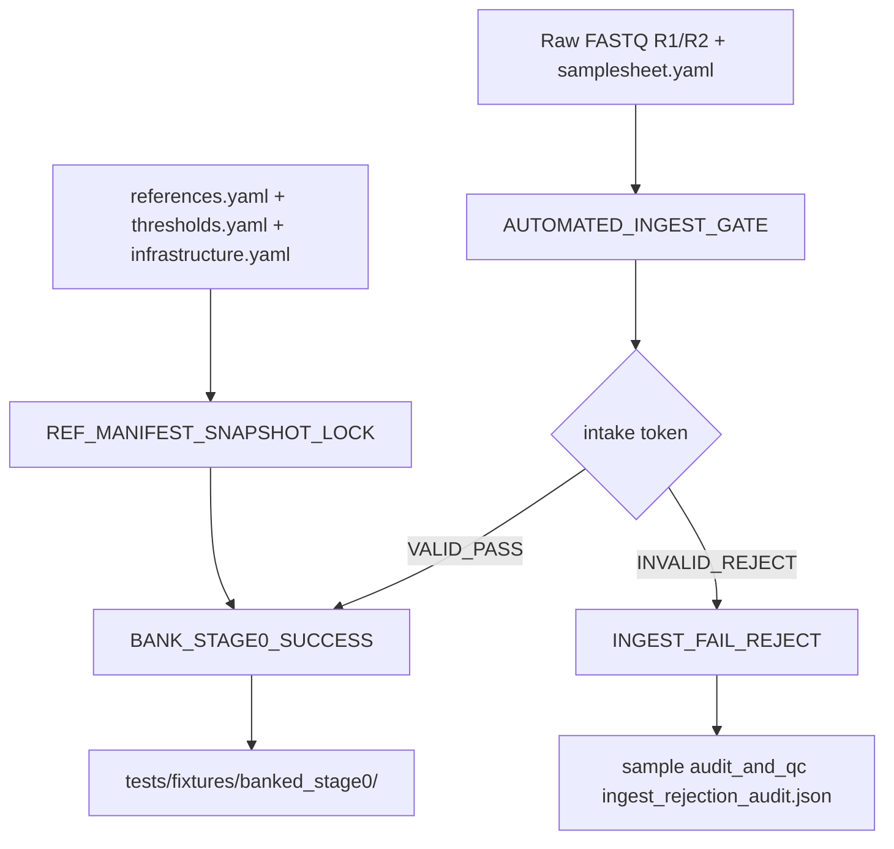

# Stage_0_Preflight_Ingest_Gate

Standalone Stage 0 micro-pipeline for preflight intake validation, reference snapshot locking, and banked fixture emission.

## Architecture Flow



### ASCII Alternative

```text
FASTQ + sample metadata ---> AUTOMATED_INGEST_GATE ---> VALID ---> BANK_STAGE0_SUCCESS ---> banked_stage0/
                                    |                    |
                                    |                    +--> intake token + audit bundle + banked samplesheet
                                    |
                                    +--> INVALID_REJECT --> INGEST_FAIL_REJECT --> ingest_rejection_audit.json

references.yaml + thresholds.yaml + infrastructure.yaml --> REF_MANIFEST_SNAPSHOT_LOCK --> reference_snapshot.tokens + yaml_snapshot_bundle.tar.gz
```

## Module Inventory

| Module | Inputs | Outputs | Failure Behavior |
|---|---|---|---|
| `REF_MANIFEST_SNAPSHOT_LOCK` | `references.yaml`, `samplesheet`, `thresholds.yaml`, `infrastructure.yaml` | `reference_snapshot.tokens`, `yaml_snapshot_bundle.tar.gz` | Hard fail on missing reference asset, failed checksum expectation, or reference consistency mismatch. |
| `AUTOMATED_INGEST_GATE` | `tuple(meta, fastq_r1, fastq_r2)`, `thresholds.yaml` | validated FASTQ symlinks, `intake_validation_token`, `*.intake_validation_report.json` | Hard fail for missing mandatory sample fields or missing files. Emits `INVALID_REJECT|...` for controlled rejection conditions including optional strict gzip/pair-count checks. |
| `EVALUATE_INTAKE_STATUS` | intake payload tuple | route decision JSON + payload passthrough | No direct halt; route decision is deterministic from token prefix. |
| `INGEST_FAIL_REJECT` | invalid intake payload, signer keypair | `*.ingest_rejection_audit.json` | Emits signed RS256 rejection audit; falls back to SHA256 signature payload only if key usage fails. |
| `BANK_STAGE0_SUCCESS` | valid intake payload + snapshot lock artifacts + infrastructure YAML | banked validated FASTQs, intake token artifact, stage0 audit bundle, manifest fragment | Fails if banking/copy/tar operations fail. |
| `ASSEMBLE_STAGE0_BANKED_MANIFEST` | all manifest fragments | `tests/samples_hg002_banked_stage0.yaml` | Fails on malformed fragments or write errors. |

## Wet Lab Fast-Fail Protocol

Stage 0 is configured to fail closed before any downstream analytical stage:

- Corrupt/truncated read archives can be rejected immediately when `ingest_manifest.strict_pair_count_check=true`, producing `FASTQ_CORRUPT_GZIP` and routing to `INGEST_FAIL_REJECT`.
- R1/R2 read-count asymmetry under strict pair-count checking produces `READ_PAIR_COUNT_MISMATCH` and immediate rejection routing.
- Reference integrity drift (path mismatch, missing files, checksum expectation mismatch) fails in `REF_MANIFEST_SNAPSHOT_LOCK` before sample progression.
- Operational objective: chaos/FMEA paths should terminate or reject in under 10 seconds and emit auditable artifacts (`ingest_rejection_audit.json` or lockout error trace).

## Banked Deliverables Contract

Stage 0 publishes to `tests/fixtures/banked_stage0/` with the following contract:

- `validated_fastqs/`
- `intake_token/`
- `audit_bundle/`
- `audit_and_qc/ref_snapshot/reference_snapshot.tokens`
- `audit_and_qc/ref_snapshot/yaml_snapshot_bundle.tar.gz`
- `<sample_id>/audit_and_qc/<sample_id>.intake_validation_report.json`
- `<sample_id>/audit_and_qc/<sample_id>.intake_route_decision.json`
- `<sample_id>/audit_and_qc/<sample_id>.ingest_rejection_audit.json` (invalid/reject scenarios)
- `tests/samples_hg002_banked_stage0.yaml`

`reference_snapshot.tokens` includes:

- SHA256 hashes for active YAML contracts (`references.yaml`, `thresholds.yaml`, `infrastructure.yaml`, plus sample manifest path used in run)
- Reference asset hash map
- Governed container digest entries for `core`, `annotation`, and `multiomics` with `BUILD_PENDING` fallback
