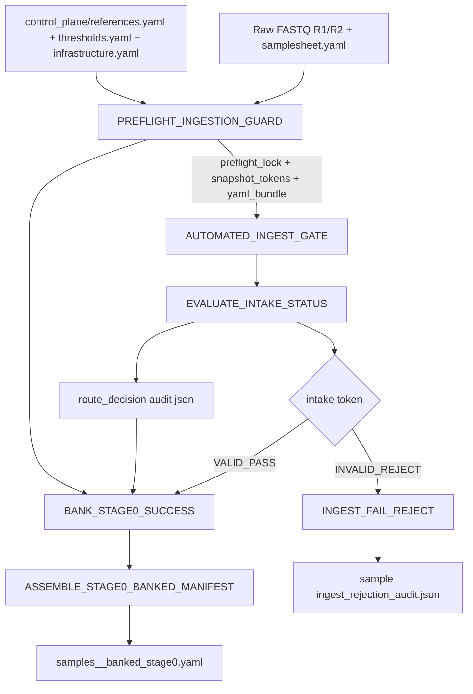

# Stage_0_Preflight_Ingest_Gate

Standalone Stage 0 micro-pipeline for preflight intake validation, reference snapshot locking, and mini-control banking.

Stage 0 now consumes governed contracts from the centralized control_plane/ directory and banks audit evidence into tests/<sample_id>/audit_and_qc/ for downstream LIMS readiness.

Current state:

- This stage is the canonical intake lock for the full pipeline and produces the preflight-lock evidence consumed downstream.
- The mini-control fixtures in `assets/mini_control/` and `Stage_0_Preflight_Ingest_Gate/tests/` are used for local validation and branch-routing smoke tests.
- Banked outputs are consumed by Stage 1 as the first regulated handoff artifact.

## Architecture Flow



### ASCII Alternative

```text
FASTQ + sample metadata -------------------------------> PREFLIGHT_INGESTION_GUARD
control_plane/references.yaml + thresholds.yaml + infrastructure.yaml ----^         |
                                    preflight_lock + snapshot tokens + yaml bundle
                                        |
                                        v
                                 AUTOMATED_INGEST_GATE -> EVALUATE_INTAKE_STATUS
                                             |            |
                                             |            +-> route decision audit
                                             |
                                       VALID_PASS ---+---> BANK_STAGE0_SUCCESS -> ASSEMBLE_STAGE0_BANKED_MANIFEST
                                             |                                  |
                                     INVALID_REJECT -+-> INGEST_FAIL_REJECT            +-> samples_<sample_id>_banked_stage0.yaml
```

## Module Inventory

| Module | Inputs | Outputs | Failure Behavior |
|---|---|---|---|
| `PREFLIGHT_INGESTION_GUARD` | preflight sample rows, `control_plane/references.yaml`, `samplesheet`, `samples manifest source`, `control_plane/thresholds.yaml`, `control_plane/infrastructure.yaml` | `preflight.lock`, `reference_snapshot.tokens`, `yaml_snapshot_bundle.tar.gz` | Hard fail on missing reference assets, checksum inconsistency, malformed contracts, or guard violations. |
| `AUTOMATED_INGEST_GATE` | `tuple(meta, fastq_r1, fastq_r2)`, `thresholds.yaml` | validated FASTQ symlinks, `intake_validation_token`, `*.intake_validation_report.json` | Hard fail for missing mandatory sample fields or missing files. Emits `INVALID_REJECT|...` for controlled rejection conditions including optional strict gzip/pair-count checks. |
| `EVALUATE_INTAKE_STATUS` | intake payload tuple | route decision JSON + payload passthrough | No direct halt; route decision is deterministic from token prefix. |
| `INGEST_FAIL_REJECT` | invalid intake payload, signer keypair | `*.ingest_rejection_audit.json` | Emits signed RS256 rejection audit; falls back to SHA256 signature payload only if key usage fails. |
| `BANK_STAGE0_SUCCESS` | valid intake payload + route decision audit + preflight lock artifacts + infrastructure YAML | banked validated FASTQs, intake token artifact, stage0 audit bundle, manifest fragment | Fails if banking/copy/tar operations fail. |
| `ASSEMBLE_STAGE0_BANKED_MANIFEST` | all manifest fragments | `<outdir>/Stage_0/samples_<sample_id>_banked_stage0.yaml` | Fails on malformed fragments or write errors. |

## Wet Lab Fast-Fail Protocol

Stage 0 is configured to fail closed before any downstream analytical stage:

- Corrupt/truncated read archives can be rejected immediately when `ingest_manifest.strict_pair_count_check=true`, producing `FASTQ_CORRUPT_GZIP` and routing to `INGEST_FAIL_REJECT`.
- R1/R2 read-count asymmetry under strict pair-count checking produces `READ_PAIR_COUNT_MISMATCH` and immediate rejection routing.
- Reference integrity drift (path mismatch, missing files, checksum expectation mismatch) fails in `PREFLIGHT_INGESTION_GUARD` before sample progression.
- Operational objective: chaos/FMEA paths should terminate or reject in under 10 seconds and emit auditable artifacts (`ingest_rejection_audit.json` or lockout error trace).

## Banked Deliverables Contract

Stage 0 publishes to `<outdir>/Stage_0/` with the following contract:

- `validated_fastqs/`
- `intake_token/`
- `audit_bundle/`
- `audit_and_qc/ref_snapshot/reference_snapshot.tokens`
- `audit_and_qc/ref_snapshot/yaml_snapshot_bundle.tar.gz`
- `<sample_id>/audit_and_qc/<sample_id>.intake_validation_report.json`
- `<sample_id>/audit_and_qc/<sample_id>.intake_route_decision.json`
- `<sample_id>/audit_and_qc/<sample_id>.ingest_rejection_audit.json` (invalid/reject scenarios)
- `<outdir>/Stage_0/samples_<sample_id>_banked_stage0.yaml`

`reference_snapshot.tokens` includes:

- SHA256 hashes for active YAML contracts (`control_plane/references.yaml`, `control_plane/thresholds.yaml`, `control_plane/infrastructure.yaml`, plus sample manifest path used in run)
- Reference asset hash map
- Governed container digest entries for `core`, `annotation`, and `reporting` with `BUILD_PENDING` fallback

## Tunable Features

| Tunable | Default | Effect |
|---|---|---|
| `--input` / `--samples` | `../assets/mini_control/samples_mini_control.yaml` | Stage 0 intake manifest. |
| `--outdir` | `tests/fixtures/banked_stage0` | Stage 0 publish root (`Stage_0` artifacts are emitted beneath this root). |
| `--references` / `--thresholds` / `--infrastructure` | `../control_plane/*.yaml` | Governance contracts for refs/thresholds/resources. |
| `--ref_data_root` / `--ref_dir` | `NXF_REF_DATA_ROOT` or stage default | Host reference root used to resolve `/opt/reference` mappings. |
| `--pki_key_dir` | `../keys` (or `NXF_PKI_KEY_DIR`) | Base directory for signer key lookup. |
| `--signer_key_path`, `--signer_pub_path` | resolved from thresholds/reporting policy | Explicit signer keypair override for signed rejection audits. |
| `-profile docker` / `-profile apptainer` | none | Runtime backend selection. |
| `-stub` | off | Stub-mode test run; avoids full data dependency for fast contract checks. |
