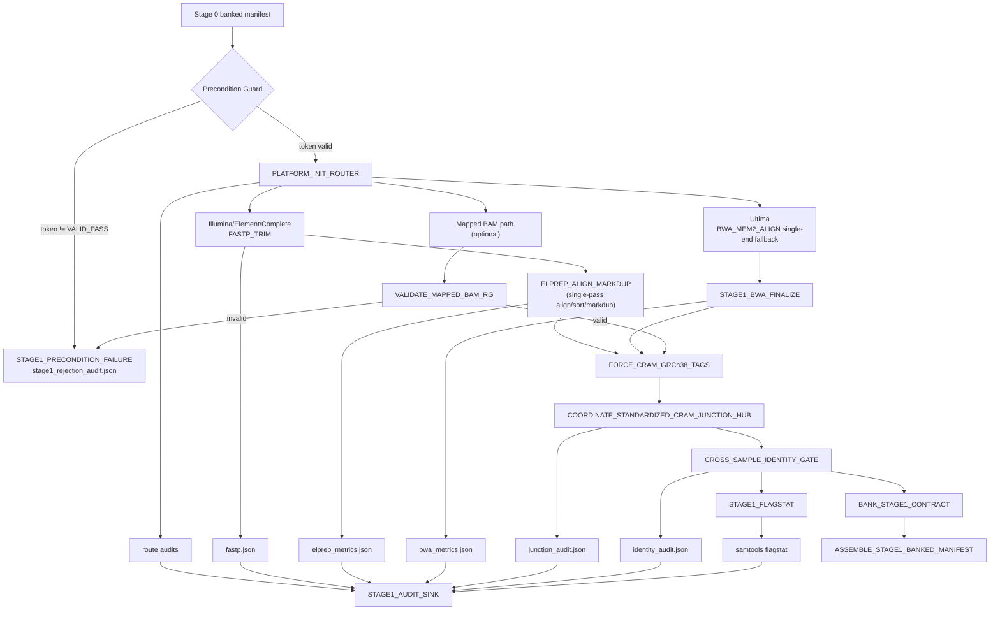

# Stage_1_Alignment_Read_Processing

Standalone Stage 1 micro-pipeline for platform-aware intake routing, alignment/read processing, coordinate normalization, identity auditing, and Stage 2 contract banking.

Current state:

- Stage 1 is the first compute-heavy handoff after Stage 0 preflight locking.
- The current contract emphasizes platform-aware routing, coordinate normalization, identity verification, and Stage 2-ready banked manifests.
- Stage 1 outputs are now documented as part of the governed stage directories and remain isolated from later clinical-interpretation branches.

## Clinical Scope

Stage 1 enforces the first clinical handoff gate after Stage 0 intake.

- Accepts only validated intake contracts from Stage 0.
- Routes by sequencer platform (`illumina`, `element`, `complete`, `ultima`, `ont`).
- Produces normalized alignment outputs and identity-verified BAM/BAI artifacts for Stage 2.

## Architecture Flow



### ASCII Alternative

```text
Stage0 manifest --> precondition gate --> platform router --> [fastp + elprep] OR [ultima bwa fallback] OR [mapped BAM RG guard]
                                                   --> force_cram_tags --> coordinate_junction --> identity_gate --> flagstat
                                                                                                 --> stage1 audit sink
                                                                                                 --> banked_stage1 contract yaml
```

## Platform-Aware Routing Matrix

| Platform | Route | Notes |
|---|---|---|
| `illumina` | `FASTP_TRIM` -> `ELPREP_ALIGN_MARKDUP` | Standard short-read paired-end lane. |
| `element` | `FASTP_TRIM` -> `ELPREP_ALIGN_MARKDUP` | AVITI-like paired-end lane with same guardrails. |
| `complete` | `FASTP_TRIM` -> `ELPREP_ALIGN_MARKDUP` | Patterned-flow metadata retained via `@RG` and `DS`. |
| `ultima` | `BWA_MEM2_ALIGN` -> `STAGE1_BWA_FINALIZE` | Specialized fallback lane for Ultima reads. |
| `ont` | Stage 1 ONT lane module(s) | Long-read path remains governed by Stage 1 preconditions and contract outputs. |

## Intake Governance and Checksum/Token Guards

Stage 1 consumes Stage 0-validated intake artifacts and enforces fail-closed conditions:

- Stage 0 token and manifest preconditions are validated before heavy compute.
- Stage 0 reference snapshot/checksum lock artifacts are carried forward as intake integrity context.
- Route decisions and intake metadata are captured in `platform_init_route.json` and Stage 1 audit sink payloads.
- Reference lineage and contract continuity are retained in Stage 1 banked outputs.
- Missing, malformed, or invalid mapped BAM metadata causes explicit Stage 1 precondition rejection.

## Pre-Execution Binary Validation

Stage 1 now includes explicit runtime guards before alignment execution:

- `ELPREP_ALIGN_MARKDUP` asserts `elprep` exists on `PATH`.
- It also rejects placeholder wrappers (fail-closed) and emits `STAGE1_PRECONDITION_FAILURE` if detected.
- This prevents accidental production execution with non-functional placeholder binaries.

## Module Inventory

| Module | Inputs | Outputs | Platforms | Failure Behavior |
|---|---|---|---|---|
| `PLATFORM_INIT_ROUTER` | `meta, fastq_1, fastq_2, intake_token, intake_report` | routed payload, `platform_init_route.json` | all short-read | route audit generated; unsupported platform is blocked in precondition guard. |
| `FASTP_TRIM` | `meta, r1, r2` | trimmed FASTQs, `fastp.json` | illumina, element, complete_genomics | process failure on I/O/tool errors. |
| `ELPREP_ALIGN_MARKDUP` | trimmed FASTQs + references | sorted markdup BAM/BAI, optical metrics, `elprep_metrics.json` | illumina, element, complete_genomics | fails closed on align/markdup/index errors. |
| `BWA_MEM2_ALIGN` + `STAGE1_BWA_FINALIZE` | FASTQ lane + references | aligned BAM/BAI, `bwa_metrics.json` | ultima | single-end fallback path for flow chemistry/specialized routing. |
| `VALIDATE_MAPPED_BAM_RG` | mapped BAM/BAI | guard token (+ optional rejection audit) | mapped short-read handoff | emits invalid token if `@RG` or required tags are missing. |
| `STAGE1_FAIL_CLOSED` | rejection audit path | `stage1_rejection_audit.json` | mapped invalid path | hard exits with `STAGE1_PRECONDITION_FAILURE`. |
| `FORCE_CRAM_GRCh38_TAGS` | BAM/BAI + ref dict | reheadered BAM/BAI | all short-read | fails on reheader/index errors. |
| `COORDINATE_STANDARDIZED_CRAM_JUNCTION_HUB` | normalized BAM/BAI | junction-verified BAM/BAI, `junction_audit.json` | all short-read | fails on `samtools quickcheck`/index issues. |
| `CROSS_SAMPLE_IDENTITY_GATE` | verified BAM/BAI + SVD/freemix config | identity audit + identity-verified BAM/BAI | all short-read | fail closed on contamination threshold breach; skip mode if insufficient markers. |
| `STAGE1_FLAGSTAT` | identity-verified BAM/BAI | `flagstat.txt` | all short-read | fails on samtools errors. |
| `STAGE1_AUDIT_SINK` | route/fastp/align/identity/junction/flagstat artifacts | `stage1_audit_payload.json` | all short-read | fails on sink assembly/write failure. |
| `BANK_STAGE1_CONTRACT` + `ASSEMBLE_STAGE1_BANKED_MANIFEST` | final BAM/BAI + ref metadata | banked files and `samples_<sample_id>_banked_stage1.yaml` | all short-read | fails if banking/manifest write fails. |

## Inputs

- Stage 0 banked manifest
- validated intake token and intake report
- reference genome, FAI, dictionary, and BWA index assets
- platform metadata and consent/context fields propagated from Stage 0

## Outputs

Published under `tests/mini_control/`:

- `aligned/*.identity_verified.bam`
- `aligned/*.identity_verified.bam.bai`
- `audit_and_qc/stage1/stage1_audit_payload.json`
- `audit_and_qc/stage1/*.flagstat.txt`
- `audit_and_qc/stage1/stage1_rejection_audit.json` (failure scenarios)
- `samples_<sample_id>_banked_stage1.yaml`

Stage 2 handoff fields include:

- `mapped_bam`
- `mapped_bai`
- `reference_build.reference_genome`
- `reference_build.reference_fai`
- `reference_build.reference_dict`
- `reference_build.bwa_index_base`

## Execute

Run Stage 1 standalone:

```bash
cd Stage_1_Alignment_Read_Processing
nextflow run main.nf \
    -profile docker \
    --input tests/mini_control/samples_<sample_id>_banked_stage0.yaml \
    --outdir tests/mini_control
```

Dev-fast validation:

```bash
cd /media/drive_c/nf_pipes/nf_Gen_Var_Pipe
NXF_REF_DATA_ROOT="/path/to/reference_root" \
nextflow run main.nf -profile dev_fast,docker -stub --input assets/mini_control/samples_mini_control.yaml -ansi-log false
```

## Platform Geometry Matrix

| Platform | Read Mode | Trimming | Alignment/Processing | Geometry Preservation |
|---|---|---|---|---|
| Illumina | paired-end | `fastp` with poly-G support | `elprep 5` (`bwa-mem2` stream + sort + markdup) | `@RG` includes `ID,PL,PU,SM,LB,DS` and flow metadata propagated from sample/meta. |
| Element (AVITI) | paired-end | `fastp` adapter/quality trimming | `elprep 5` pathway | same `@RG` preservation guarantees. |
| Complete Genomics / DNBseq | paired-end | `fastp` filtering | `elprep 5` pathway | patterned geometry encoded in `DS` and carried through reheader/junction checks. |
| Ultima | single-end fallback (workflow route) | no mandatory fastp trim in fallback lane | `bwa-mem2` fallback + finalize index/metrics | `@RG` includes full required tag set with flow geometry in `DS`. |

## FMEA

```bash
python3 tests/fmea/run_stage1_fmea_suite.py
```

## Notes

### Local rerun guidance

- Recommended scratch volume: /scratch
- Default Stage 1 work directory: /scratch/nextflow_work
- Default Stage 1 temp directory: /scratch/tmp
- Heavy-path CPU ceiling: 30 cores
