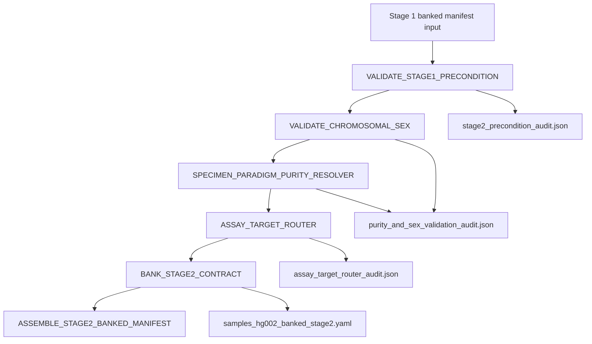

# Stage 2: Post-Align Sample Validation Gate

`Stage_2_PostAlign_Sample_Validation_Gate` is a standalone micro-pipeline that gates downstream variant discovery with fail-closed pre-calling checks.

## Clinical Scope

This stage validates that Stage 1 contract prerequisites are present and clinically acceptable before Stage 3 compute-heavy callers begin:

- Stage 1 contract/token enforcement (`VALID_PASS|INTAKE_VALIDATED`)
- Sorted BAM/BAI availability validation
- Chromosomal sex concordance validation (GRCh38 non-PAR `chrY/chrX` ratio)
- In-silico purity cross-check for somatic and liquid biopsy paradigms
- VerifyBamID2 contamination thresholding (default `< 1.0%`)
- Germline subclonal CHIP/mosaicism detection in low-VAF window
- Assay target routing validation (WES/WGS/PANEL)
- Stage 2 annotated contract banking for Stage 3

## Clinical Governance Gates

| Gate | Module | Default Rule |
|---|---|---|
| Stage 1 contract precondition | `VALIDATE_STAGE1_PRECONDITION` | fail closed on missing tokens/assets. |
| Contamination | `VERIFYBAMID2` | `STAGE2_CONTAMINATION_FAILURE` when `FREEMIX > 0.01`. |
| Sex concordance | `VALIDATE_CHROMOSOMAL_SEX` | configurable fail-closed on discordance. |
| Purity concordance | `SPECIMEN_PARADIGM_PURITY_RESOLVER` | configurable fail-closed on excessive purity delta. |
| Assay target routing | `ASSAY_TARGET_ROUTER` | fail closed when branch/target catalogs are invalid or missing. |

## Architecture Flow



## Module Inventory

- `modules/local/validate_stage1_precondition.nf`
- `modules/local/validate_chromosomal_sex.nf`
- `modules/local/specimen_paradigm_purity_resolver.nf`
- `modules/local/assay_target_router.nf`
- `modules/local/bank_stage2_contract.nf`
- `modules/local/assemble_stage2_banked_manifest.nf`

## Key Algorithms

### VerifyBamID2 contamination gate

- Executes VerifyBamID2 using configured SVD/UD/bed assets.
- Extracts `FREEMIX` contamination estimate.
- Uses configurable threshold (`clinical.contamination.freemix_germline_limit`), default `0.01`.

### GRCh38 PAR-masked sex gate

- Computes depth on non-PAR intervals:
  - `chrX:2781480-155701382`
  - `chrY:2781480-56887902`
- Evaluates ratio against configured floor (`chromosome_y_depth_floor`).

### Purity and CHIP/mosaicism

- Performs target-region pileup and heterozygous VAF spectrum analysis.
- Compares estimated in-silico purity to physician/pathologist purity fields.
- For germline/normal contexts, evaluates persistent `5-15%` VAF burden as CHIP/mosaicism review signal.

## `sample_qc_meta` Output Contract

Stage 2 emits a compact scalar block for Stage 3 calibration:

| Field | Type | Description |
|---|---|---|
| `estimated_in_silico_purity` | float/null | purity estimate from heterozygous-site spectrum. |
| `contamination_rate` | float/null | VerifyBamID2 `FREEMIX` estimate. |
| `computed_sex` | enum | `XX`/`XY`/`UNKNOWN` from non-PAR ratio gate. |
| `sex_concordance_pass` | bool | sex concordance decision scalar. |
| `purity_concordance_pass` | bool | purity concordance decision scalar. |

## Inputs

- `--input`: Stage 1 banked manifest (`*banked_stage1*.yaml`)
- `--references`: references YAML contract
- `--thresholds`: thresholds YAML contract
- `--outdir`: Stage 2 bank directory

## Outputs

- `audit_and_qc/stage2/*.stage2_precondition_audit.json`
- `audit_and_qc/stage2/*.purity_and_sex_validation_audit.json`
- `audit_and_qc/stage2/*.assay_target_router_audit.json`
- `samples_hg002_banked_stage2.yaml`

## Execute

```bash
cd Stage_2_PostAlign_Sample_Validation_Gate
nextflow run main.nf \
  -profile docker \
  --input ../Stage_1_Alignment_Read_Processing/tests/fixtures/banked_stage1/samples_hg002_banked_stage1.yaml \
  --references ../conf/references.yaml \
  --thresholds ../conf/thresholds.yaml \
  --outdir tests/fixtures/banked_stage2/
```

## FMEA

```bash
python3 tests/fmea/run_stage2_fmea_suite.py
```
