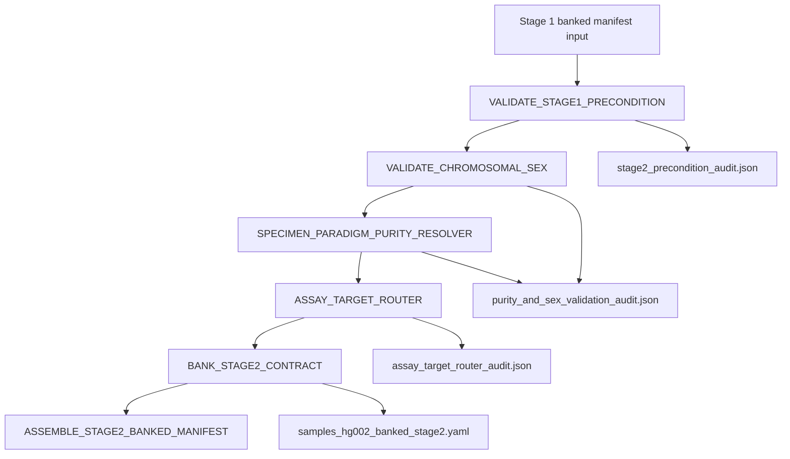

# Stage 2: Post-Align Sample Validation Gate

`Stage_2_PostAlign_Sample_Validation_Gate` is a standalone micro-pipeline that gates downstream variant discovery with fail-closed pre-calling checks.

## Purpose

This stage validates that Stage 1 contract prerequisites are present and clinically acceptable before Stage 3 compute-heavy callers begin:

- Stage 1 contract/token enforcement (`VALID_PASS|INTAKE_VALIDATED`)
- Sorted BAM/BAI availability validation
- Chromosomal sex concordance validation (chrY/chrX ratio)
- In-silico purity cross-check for somatic and liquid biopsy paradigms
- Assay target routing validation (WES/WGS/PANEL)
- Stage 2 annotated contract banking for Stage 3

## Flow Diagram



## Module Inventory

- `modules/local/validate_stage1_precondition.nf`
- `modules/local/validate_chromosomal_sex.nf`
- `modules/local/specimen_paradigm_purity_resolver.nf`
- `modules/local/assay_target_router.nf`
- `modules/local/bank_stage2_contract.nf`
- `modules/local/assemble_stage2_banked_manifest.nf`

## Inputs

- `--input`: Stage 1 banked manifest (`*banked_stage1*.yaml`)
- `--references`: references YAML contract
- `--thresholds`: thresholds YAML contract
- `--outdir`: Stage 2 bank directory

## Outputs

- `audit_and_qc/stage2/*.stage2_precondition_audit.json`
- `audit_and_qc/stage2/*.purity_and_sex_validation_audit.json`
- `audit_and_qc/stage2/*.assay_target_router_audit.json`
- `samples_hg002_banked_stage2.yaml`

## Run Command

```bash
cd /media/drive_c/nf_pipes/nf_Gen_Var_Pipe/Stage_2_PostAlign_Sample_Validation_Gate
nextflow run main.nf \
  -profile docker \
  --input /media/drive_c/nf_pipes/nf_Gen_Var_Pipe/Stage_1_Alignment_Read_Processing/tests/fixtures/banked_stage1/samples_hg002_banked_stage1.yaml \
  --references /media/drive_c/nf_pipes/nf_WES_Onco_Risk/references.yaml \
  --thresholds /media/drive_c/nf_pipes/nf_WES_Onco_Risk/thresholds.yaml \
  --outdir tests/fixtures/banked_stage2/
```

## FMEA Suite

```bash
python tests/fmea/run_stage2_fmea_suite.py
```
