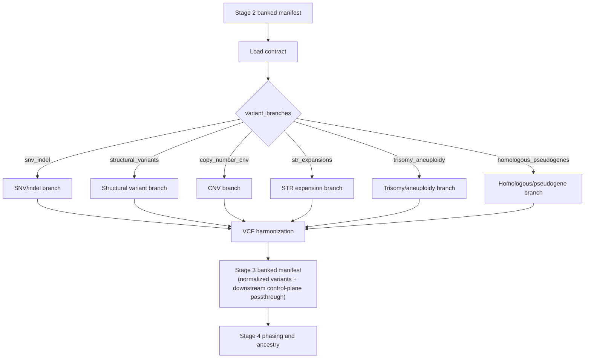

# Stage 3: Variant Discovery Engine

`Stage_3_Variant_Discovery_Engine` consumes the Stage 2 banked manifest and executes only the variant branches explicitly enabled in the contract.

Current state:

- Stage 3 branch execution is contract-driven and remains isolated by branch identifier.
- The current structure supports the full discovery set and produces a stable Stage 4 handoff manifest.
- Audit outputs are organized to preserve zero-loss branch provenance into phasing and clinical interpretation.

Current production-wired branches:

- `snv_indel`
- `structural_variants` (SV and large indels)
- `copy_number_cnv`
- `str_expansions`
- `trisomy_aneuploidy`
- `homologous_pseudogenes`

## Clinical Scope

Stage 3 is the production discovery and harmonization gate that converts Stage 2 QC-qualified samples into schema-validated, Stage 4-ready normalized variant payloads.

## September 2026 Update

- Stage 3 branch execution remains strictly driven by contract-declared `variant_branches`.
- Stage 3 banking remains immutable and schema-governed, producing a stable Stage 4 handoff contract.
- Contract portability hardening was applied in Stage 3 zero-loss manifest assembly so BAM/BAI references remain stable across execution roots.

## Architecture Flow



## Branch Toggles

All listed branch toggles are implemented in active Stage 3 wiring.

SNV caller selection:

- Default: `deepvariant` (`params.stage3_snv_caller = 'deepvariant'`)
- Alternate: `bcftools` (`params.stage3_snv_caller = 'bcftools'`)

## Dynamic Calibration and Filters

Stage 3 derives runtime filter parameters from Stage 2 `sample_qc_meta`:

| Calibration | Derivation |
|---|---|
| Dynamic VAF floor (`dynamic_min_vaf`) | Purity-aware, somatic-sensitive floor (bounded). |
| Dynamic allele-balance floor (`dynamic_ab_floor`) | Contamination-aware AB floor (bounded). |
| Ploidy table | Computed from `computed_sex` for chrX/chrY handling. |

Core SNV/indel lane behavior:

- `run_deepvariant` primary caller (or `bcftools` alternate path)
- Post-atomization `AD`/`DP` normalization per record
- Contamination-aware binomial-style allele-balance filtering (`LOW_AB`) and purity-aware VAF filtering (`LOW_VAF`) with audit counters

Core structural-variant lane behavior (modeled on the earlier SV lane design):

- `configManta.py` + `runWorkflow.py` for discovery
- target-region intersection using `bcftools view -R` for non-WGS inputs
- QUAL floor filtering using governed thresholds (`somatic_qual_floor` / `germline_qual_floor`)
- structural/large-indel retention with `BRANCH=structural_variants` INFO tag and branch audit counters
- fail-closed tool checks (no silent placeholder fallback in active execution path)

Core CNV lane behavior:

- CNVkit segmentation/calling from BAM evidence
- Independent depth validation lane (`samtools depth`) for concordance auditing
- CNV VCF emission with branch tags and `LOW_LOG2` filter states

Core STR lane behavior:

- ExpansionHunter using governed catalog
- VCF-first ingestion with JSON fallback parsing
- STR VCF emission tagged as `BRANCH=str_expansions`

Core trisomy/aneuploidy lane behavior:

- Chromosome-level depth model from `samtools idxstats`
- Conservative trisomy signals (chr13/18/21) based on ratio and z-score thresholds
- Addon-style VCF emission only when thresholds are exceeded

Core homologous/pseudogene lane behavior:

- Mask-restricted calling (`bcftools mpileup/call` over homologous-risk BED)
- `PARALOG_HOMOLOGY=1` evidence tagging for downstream PGx-aware interpretation

## MANE Prioritization

`MANE_TRANSCRIPT_SELECTOR` annotates records with:

- `MANE_PRIORITY` (`MANE_PLUS_CLINICAL`, `MANE_SELECT`, `NONE`)
- `MANE_TRANSCRIPT`

using the configured MANE transcript asset.

## GA4GH/VCF Schema Validation

`MASTER_HARMONIZED_VCF_PAYLOAD` enforces schema-level checks against:

- `Stage_3_Variant_Discovery_Engine/tests/schemas/v4.2_Production_Schema.json`

Validation includes:

- required fileformat/header prefix checks
- required column ordering
- mandatory REF/ALT/POS integrity checks
- fail-closed exit with `STAGE3_SCHEMA_VALIDATION_FAILURE` on violations

## Fault-Injection Safety

The controlled corrupt-header path is fail-closed in production behavior:

- malformed-header injection emits explicit schema failure signal
- process exits non-zero (`exit 130`)

This prevents silent success on deliberately malformed payloads.

## Module Inventory

- `modules/local/stage3_snv_indel.nf`
- `modules/local/stage3_snv_indel_deepvariant.nf`
- `modules/local/stage3_structural_variants.nf`
- `modules/local/stage3_copy_number_cnv.nf`
- `modules/local/stage3_str_expansions.nf`
- `modules/local/stage3_trisomy_aneuploidy.nf`
- `modules/local/stage3_homologous_pseudogenes.nf`
- `modules/local/mane_transcript_selector.nf`
- `modules/local/master_harmonized_vcf_payload.nf`
- `modules/local/assemble_stage3_banked_manifest.nf`

## Inputs

- Stage 2 banked manifest with `validation_token`, `mapped_bam`, `mapped_bai`, `reference_build`, and `sample_qc_meta`
- branch toggles under `variant_branches`
- Stage 3 schema path via configured refs

## Outputs

- `<outdir>/Stage_3/samples_<sample_id>_banked_stage3.yaml`

## Tunable Features

| Tunable | Default | Effect |
|---|---|---|
| `--input` / `--samples` | `tests/samples_variant_discovery.yaml` | Stage 2-to-Stage 3 intake manifest. |
| `--outdir` | `tests/banked_stage3` | Stage 3 publish root; effective path is `<outdir>/Stage_3`. |
| `--references` / `--thresholds` / `--infrastructure` | `../control_plane/*.yaml` | Governs discovery references, dynamic thresholds, and infra policy. |
| `--stage3_snv_caller` | `deepvariant` | SNV lane caller selection (`deepvariant` or `bcftools`). |
| `--infrastructure_profile` | auto | Forces Stage 3 profile (`small|medium|large`) instead of auto selection. |
| `--stage3_snv_indel_cpus` | null | SNV/indel branch CPU override. |
| `--stage3_structural_variants_cpus` or `--stage3_sv_cpus` | null | SV branch CPU override. |
| `--stage3_cnv_cpus` | null | CNV branch CPU override. |
| `--stage3_str_cpus` | null | STR branch CPU override. |
| `--stage3_trisomy_cpus` | null | Trisomy branch CPU override. |
| `--stage3_homologous_cpus` | null | Homologous/pseudogene branch CPU override. |
| `--stage3_cpus` | null | Global Stage 3 CPU override fallback. |
| `--stage3_test_mode` | `false` | Enables Stage 3 test-mode behavior used in controlled validation scenarios. |

## Audit Hygiene

- Production evidence directories: `<outdir>/Stage_3/snv`, `<outdir>/Stage_3/sv`, `<outdir>/Stage_3/cnv`, `<outdir>/Stage_3/str`
- `<outdir>/Stage_3/` is production-only. Do not keep smoke/stub outputs under this path.

Run the production evidence verifier before audit/regulatory packaging:

```bash
./scripts/verify_stage3_production_evidence.sh
```

## Execute

```bash
cd Stage_3_Variant_Discovery_Engine
nextflow run main.nf \
    -profile docker \
    --input <stage2_outdir>/Stage_2/samples_<sample_id>_banked_stage2.yaml \
    --outdir results
```

## FMEA

```bash
python3 tests/fmea/run_stage3_fmea_suite.py
```
