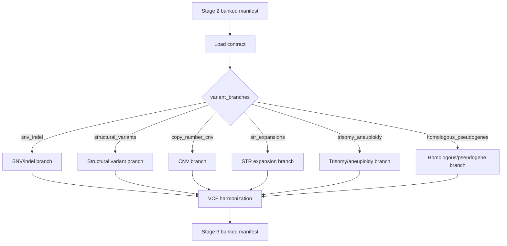

# Stage 3: Variant Discovery Engine

`Stage_3_Variant_Discovery_Engine` consumes the Stage 2 banked manifest and executes only the variant branches explicitly enabled in the contract.

## Clinical Scope

Stage 3 is the production discovery and harmonization gate that converts Stage 2 QC-qualified samples into schema-validated, Stage 4-ready normalized variant payloads.

## Architecture Flow



## Branch Toggles

- `snv_indel`
- `structural_variants`
- `copy_number_cnv`
- `str_expansions`
- `trisomy_aneuploidy`
- `homologous_pseudogenes`

## Dynamic Calibration and Filters

Stage 3 derives runtime filter parameters from Stage 2 `sample_qc_meta`:

| Calibration | Derivation |
|---|---|
| Dynamic VAF floor (`dynamic_min_vaf`) | Purity-aware, somatic-sensitive floor (bounded). |
| Dynamic allele-balance floor (`dynamic_ab_floor`) | Contamination-aware AB floor (bounded). |
| Ploidy table | Computed from `computed_sex` for chrX/chrY handling. |

Core SNV/indel lane behavior:

- `bcftools mpileup` + `bcftools call`
- `bcftools norm --atomize`
- Post-atomization `AD`/`DP` normalization per record
- Contamination-aware binomial-style allele-balance filtering (`LOW_AB`) and purity-aware VAF filtering (`LOW_VAF`) with audit counters

## MANE Prioritization

`MANE_TRANSCRIPT_SELECTOR` annotates records with:

- `MANE_PRIORITY` (`MANE_PLUS_CLINICAL`, `MANE_SELECT`, `NONE`)
- `MANE_TRANSCRIPT`

using the configured MANE transcript asset.

## GA4GH/VCF Schema Validation

`MASTER_HARMONIZED_VCF_PAYLOAD` enforces schema-level checks against:

- `Stage_3_Variant_Discovery_Engine/tests/schemas/v4.2_Production_Schema.json`

Validation includes:

- required fileformat/header prefix checks
- required column ordering
- mandatory REF/ALT/POS integrity checks
- fail-closed exit with `STAGE3_SCHEMA_VALIDATION_FAILURE` on violations

## Fault-Injection Safety

The controlled corrupt-header path is fail-closed in production behavior:

- malformed-header injection emits explicit schema failure signal
- process exits non-zero (`exit 130`)

This prevents silent success on deliberately malformed payloads.

## Module Inventory

- `modules/local/load_stage2_contract.nf`
- `modules/local/branch_snv_indel.nf`
- `modules/local/branch_structural_variants.nf`
- `modules/local/branch_copy_number_cnv.nf`
- `modules/local/branch_str_expansions.nf`
- `modules/local/branch_trisomy_aneuploidy.nf`
- `modules/local/mane_transcript_selector.nf`
- `modules/local/master_harmonized_vcf_payload.nf`
- `modules/local/assemble_stage3_banked_manifest.nf`

## Inputs

- Stage 2 banked manifest with `validation_token`, `sorted_bam`, `sorted_bai`, `reference_build`, and `sample_qc_meta`
- branch toggles under `variant_branches`
- Stage 3 schema path via configured refs

## Outputs

- `tests/fixtures/banked_stage3/samples_hg002_banked_stage3.yaml`

## Execute

```bash
cd Stage_3_Variant_Discovery_Engine
nextflow run main.nf \
    -profile docker \
    --input ../Stage_2_PostAlign_Sample_Validation_Gate/tests/fixtures/banked_stage2/samples_hg002_banked_stage2.yaml \
    --outdir tests/fixtures/banked_stage3
```

## FMEA

```bash
python3 tests/fmea/run_stage3_fmea_suite.py
```
