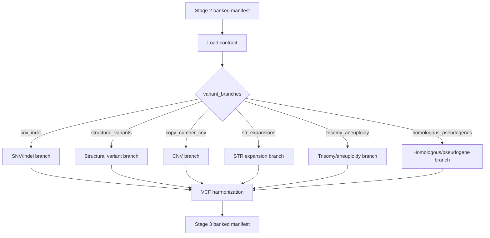

# Stage 3: Variant Discovery Engine

`Stage_3_Variant_Discovery_Engine` consumes the Stage 2 banked manifest and executes only the variant branches explicitly enabled in the contract.

## Branch toggles

- `snv_indel`
- `structural_variants`
- `copy_number_cnv`
- `str_expansions`
- `trisomy_aneuploidy`
- `homologous_pseudogenes`

## Flow

## Modules

- `modules/local/load_stage2_contract.nf`
- `modules/local/branch_snv_indel.nf`
- `modules/local/branch_structural_variants.nf`
- `modules/local/branch_copy_number_cnv.nf`
- `modules/local/branch_str_expansions.nf`
- `modules/local/branch_trisomy_aneuploidy.nf`
- `modules/local/assemble_stage3_banked_manifest.nf`

## Output

- `tests/fixtures/banked_stage3/samples_hg002_banked_stage3.yaml`
