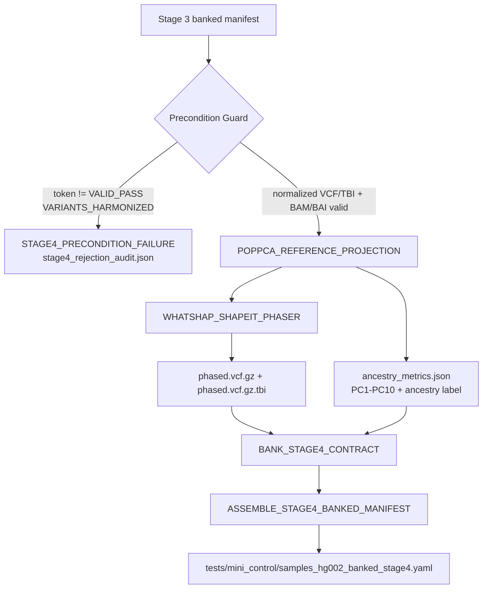

# Stage_4_Ancestry_Phasing_Highway

Standalone Stage 4 micro-pipeline for ancestry projection and haplotype phasing after Stage 3 harmonization.

## Clinical Scope

Stage 4 transforms Stage 3 harmonized variants into ancestry- and phasing-aware handoff artifacts required by Stage 5 clinical interpretation.

Execution order is enforced as:

1. two-layer PopPCA projection (Layer 1 superpopulation, Layer 2 subpopulation)
2. read-backed phasing over the ancestry-projected payload
3. immutable Stage 4 contract banking for Stage 5

## Architecture Flow



## Population Projection and Phasing Stack

| Layer | Engine | Purpose |
|---|---|---|
| Population projection (Layer 1: superpopulation / Layer 2: subpopulation) | `POPPCA_REFERENCE_PROJECTION` (`nf_PopPCA_refgen`) | Produces PC1-PC10 coordinates and hierarchical population labels. |
| Read-backed phasing | `WHATSHAP_SHAPEIT_PHASER` | Produces phased VCF + index with audit payload. |

Implementation notes:

- Projection metadata records `projection_engine: nf_PopPCA_refgen`.
- Projection method is tool-aware (`plink2_projection` when available, deterministic guarded fallback otherwise).
- Layer assignment is model-structure aware (`models/layer2/<superpopulation>/...`) with deterministic selection fallback when model assets are sparse.
- Runtime toolchain aligns with PLINK 1.9/2.0 compatible reference projection workflows.

## Module Inventory

| Module | Inputs | Outputs | Purpose |
|---|---|---|---|
| `POPPCA_REFERENCE_PROJECTION` | Stage 3 VCF/BAI + BAM/BAI + PopPCA models | `ancestry_metrics.json` | Generates deterministic ancestry coordinates and label assignments from the harmonized Stage 3 contract. |
| `WHATSHAP_SHAPEIT_PHASER` | harmonized VCF/TBI + BAM/BAI + ancestry metrics | `phased.vcf.gz`, `phased.vcf.gz.tbi`, `phasing_audit.json` | Performs read-backed phasing via the governed Stage 4 phasing lane. |
| `BANK_STAGE4_CONTRACT` | ancestry metrics + phased outputs | contract fragment JSON | Captures Stage 4 handoff data for Stage 5. |
| `ASSEMBLE_STAGE4_BANKED_MANIFEST` | stage4 fragments | `samples_hg002_banked_stage4.yaml` | Renders the banked Stage 4 manifest. |

## Inputs

Expected input:

- [Stage 3 banked manifest](../Stage_3_Variant_Discovery_Engine/tests/mini_control/samples_hg002_banked_stage3.yaml)

Required fields:

- `validation_token` containing `VALID_PASS|VARIANTS_HARMONIZED`
- `normalized_vcf`
- `normalized_vcf_tbi`
- `sorted_bam`
- `sorted_bai`
- `reference_build`
- `consent_tokens` / `stage0_consent_tokens`

## Outputs

Published to `tests/mini_control/`:

- `phased/*.phased.vcf.gz`
- `phased/*.phased.vcf.gz.tbi`
- `audit_and_qc/stage4/*.ancestry_metrics.json`
- `audit_and_qc/stage4/*.phasing_audit.json`
- `samples_hg002_banked_stage4.yaml`

## Execute

```bash
cd Stage_4_Ancestry_Phasing_Highway
nextflow run main.nf \
    -profile docker \
    --input ../Stage_3_Variant_Discovery_Engine/tests/mini_control/samples_hg002_banked_stage3.yaml \
    --references ../conf/references.yaml \
    --thresholds ../conf/thresholds.yaml \
    --outdir tests/mini_control
```

## FMEA

```bash
python3 tests/fmea/run_stage4_fmea_suite.py
```

## Notes

- Stage 4 fails closed if the Stage 3 token is invalid, the harmonized VCF/TBI is missing, or the PopPCA model directory is unavailable.
- If `plink2` or `whatshap` are unavailable in the runtime image, Stage 4 emits governed deterministic audits while still producing the banked outputs from the validated inputs.
