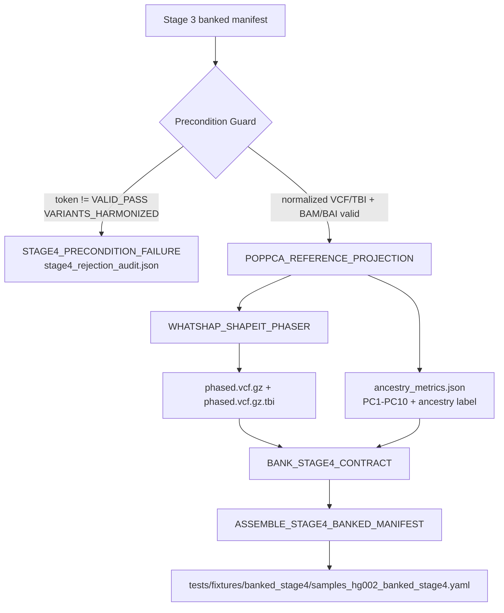

# Stage_4_Ancestry_Phasing_Highway

Standalone Stage 4 micro-pipeline for ancestry projection and haplotype phasing after Stage 3 harmonization.

## Architecture Flow

## Module Inventory

| Module | Inputs | Outputs | Purpose |
|---|---|---|---|
| `POPPCA_REFERENCE_PROJECTION` | Stage 3 VCF/BAI + BAM/BAI + PopPCA models | `ancestry_metrics.json` | Generates deterministic ancestry coordinates and label assignments from the harmonized Stage 3 contract. |
| `WHATSHAP_SHAPEIT_PHASER` | harmonized VCF/TBI + BAM/BAI + ancestry metrics | `phased.vcf.gz`, `phased.vcf.gz.tbi`, `phasing_audit.json` | Performs read-backed phasing via the governed Stage 4 phasing lane. |
| `BANK_STAGE4_CONTRACT` | ancestry metrics + phased outputs | contract fragment JSON | Captures Stage 4 handoff data for Stage 5. |
| `ASSEMBLE_STAGE4_BANKED_MANIFEST` | stage4 fragments | `samples_hg002_banked_stage4.yaml` | Renders the banked Stage 4 manifest. |

## Input Contract

Expected input:

- [Stage 3 banked manifest](../Stage_3_Variant_Discovery_Engine/tests/fixtures/banked_stage3/samples_hg002_banked_stage3.yaml)

Required fields:

- `validation_token` containing `VALID_PASS|VARIANTS_HARMONIZED`
- `normalized_vcf`
- `normalized_vcf_tbi`
- `sorted_bam`
- `sorted_bai`
- `reference_build`
- `consent_tokens` / `stage0_consent_tokens`

## Output Contract

Published to `tests/fixtures/banked_stage4/`:

- `phased/*.phased.vcf.gz`
- `phased/*.phased.vcf.gz.tbi`
- `audit_and_qc/stage4/ancestry_metrics.json`
- `audit_and_qc/stage4/phasing_audit.json`
- `samples_hg002_banked_stage4.yaml`

## Notes

- Stage 4 fails closed if the Stage 3 token is invalid, the harmonized VCF/TBI is missing, or the PopPCA model directory is unavailable.
- If `plink2` or `whatshap` are unavailable in the runtime image, Stage 4 emits governed deterministic audits while still producing the banked outputs from the validated inputs.
