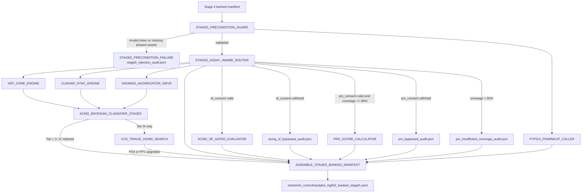

# Stage_5_Clinical_Annotation_PGx_Triage

Production-grade standalone Stage 5 micro-pipeline for clinical annotation, Bayesian ACMG/AMP triage, gated secondary findings and PRS reporting, and independent phased PGx interpretation.

## Clinical Scope

Stage 5 consumes Stage 4 phased outputs and executes five parallel interpretation channels before assembling and signing the clinical bundle for Stage 6.

## Parallel Clinical Channels

| Channel | Core Modules | Primary Output |
|---|---|---|
| Germline triage | `GERMLINE_TRIAGE_ENGINE` | germline interpretation summary payload |
| Somatic/VUS triage | `SOMATIC_ONCO_TRIAGE` + VUS upgrade logic | VUS queue + upgraded evidence payload |
| PGx (PyPGx/PharmCAT lane) | `PGX_DIPLOTYPE_RESOLVER` (+ stage router lane) | `pgx_report.json` |
| PRS scoring | `PRS_RISK_SCORE_ENGINE` | calibrated PRS report or governed bypass audit |
| SF-ACMG opt-out/consent lane | `ACMG_SF73_CLASSIFIER` / opt-out branch | SF report or consent bypass audit |

## Architecture Flow



## Cryptographic Integrity

Stage 5 signs and packages the final clinical bundle through `CLINICAL_PROVENANCE_MANIFEST`:

- bundles branch outputs into `${sample_id}.clinical_bundle.tar.gz`
- computes SHA-256 digests for inputs/outputs and bundle payload
- signs bundle digest with RS256 (`cryptography` primary, OpenSSL fallback)
- emits `${sample_id}.provenance.json` with digital signature block

Signature fields include:

- `signature_algorithm: RS256`
- `signature_value`
- `signer_id`
- `public_key_fingerprint`
- `signed_digest_sha256`

## Module Inventory

- `stage5_precondition_guard.nf`: Pass-through guard module that emits a per-sample validation audit after Stage 4 contract checks succeed.
- `stage5_assay_aware_router.nf`: Computes SF target coverage and PRS backbone coverage and emits uniform, sample-keyed branch inputs.
- `vep_core_engine.nf`: Stage-local VEP-core analogue that annotates all phased VCF variants and invokes `bin/translate_vep_to_acmg.py`.
- `clinvar_sync_engine.nf`: Produces ClinVar `>= 2`-star assertion payloads for all observed variants.
- `gnomad_aggregator_sieve.nf`: Runs ancestry-aware background frequency sieving using `bin/custom_freq_sieve.py`.
- `vus_triage_hgmd_search.nf`: Converges the first three streams through `bin/acmg_bayesian_classifier.py`, extracts Tier III candidates, and performs HGMD-style upgrade triage.
- `acmg_sf_gated_evaluator.nf`: Generates `sf_report.json` or `acmg_sf_bypassed_audit.json` depending on SF consent state.
- `prs_score_calculator.nf`: Generates `prs_calibrated_report.json`, `prs_bypassed_audit.json`, or `prs_insufficient_coverage_audit.json`.
- `pypgx_pharmcat_caller.nf`: Independent phased PGx lane for core loci including `CYP2D6`, `CYP2C19`, `CYP2C9`, `SLCO1B1`, `DPYD`, `TPMT`, and `VKORC1`.
- `assemble_stage5_banked_manifest.nf`: Consolidates branch fragments into the banked Stage 5 handoff contract.

## Inputs

Expected input:

- `--input ../Stage_4_Ancestry_Phasing_Highway/tests/mini_control/samples_hg002_banked_stage4.yaml`

Required per sample:

- `validation_token` containing `VALID_PASS|VARIANTS_HARMONIZED`
- `phased_vcf`
- `phased_vcf_tbi`
- `consent_tokens` or `stage0_consent_tokens`
- Stage 4 ancestry fields used to calibrate downstream filters

## Outputs

Published under `tests/mini_control/`:

- `annotation/*.vep_core_annotations.json`
- `annotation/*.vep_to_acmg_rules.json`
- `annotation/*.clinvar_2star_assertions.json`
- `annotation/*.gnomad_sieve_rules.json`
- `annotation/*.stage5_acmg_tiered_variants.json`
- `annotation/*.stage5_vus_triage_queue.json`
- `secondary_findings/*.sf_report.json`
- `secondary_findings/*.acmg_sf_bypassed_audit.json`
- `prs/*.prs_calibrated_report.json`
- `prs/*.prs_bypassed_audit.json`
- `prs/*.prs_insufficient_coverage_audit.json`
- `pgx/*.pgx_report.json`
- `audit_and_qc/stage5/*.stage5_router.json`
- `audit_and_qc/stage5/*.stage5_precondition_guard.json`
- `samples_hg002_banked_stage5.yaml`

## Execute

```bash
cd Stage_5_Clinical_Annotation_PGx_Triage
nextflow run main.nf \
  -profile docker \
  --input ../Stage_4_Ancestry_Phasing_Highway/tests/mini_control/samples_hg002_banked_stage4.yaml \
  --references ../conf/references.yaml \
  --thresholds ../conf/thresholds.yaml \
  --outdir tests/mini_control/
```

For signer key overrides:

```bash
nextflow run main.nf -profile docker \
  --input ../Stage_4_Ancestry_Phasing_Highway/tests/mini_control/samples_hg002_banked_stage4.yaml \
  --signer_key_path ../keys/clinical_signer.pem \
  --signer_pub_path ../keys/clinical_signer.pub.pem
```

## FMEA

Run:

```bash
python3 tests/fmea/run_stage5_fmea_suite.py
```

Scenarios:

- `invalid_stage4_token` -> fail closed with `STAGE5_PRECONDITION_FAILURE`.
- `unconsented_sf_access_attempt` -> bypass SF and emit audit payload.
- `unconsented_prs_access_attempt` -> bypass PRS and emit audit payload.
- `insufficient_prs_backbone_coverage` -> emit coverage audit without crashing.

## Notes

Stage-local helper scripts are provided in `bin/`:

- `translate_vep_to_acmg.py`
- `custom_freq_sieve.py`
- `acmg_bayesian_classifier.py`

These are adapted stage-local implementations because the exact requested helper filenames are not present in the source repository `bin/` directory.
