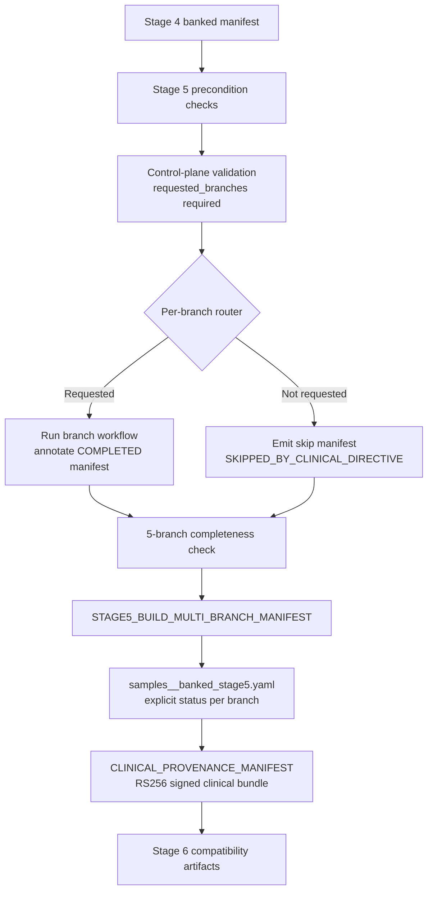

# Stage_5_Clinical_Annotation_PGx_Triage

Production Stage 5 branch engine that consumes Stage 4 phased/ancestry-ready payloads, runs parallel clinical interpretation lanes, signs the clinical bundle, and emits a Stage 6-ready banked manifest.

Current state:

- Stage 5 is the branch-isolated clinical interpretation layer and is now governed by explicit `requested_branches` routing.
- Executed and skipped branches both emit auditable status metadata for later regulated review.
- The signed bundle and provenance outputs are the canonical inputs to Stage 6 signature verification and reporting.

## Clinical Scope

Stage 5 is the interpretation and packaging layer between Stage 4 phasing and Stage 6 reporting. It enforces Stage 4 token/asset preconditions, fans out into independent branch lanes, then cryptographically signs the assembled clinical bundle.

## September 2026 Control-Plane Hardening

- Stage 5 now enforces fail-closed branch routing from `requested_branches` per sample.
- Missing `requested_branches`, non-list values, blank branch identifiers, unknown branches, or duplicates fail hard with `STAGE5_CONTROL_PLANE_FAILURE`.
- Unrequested branches do not execute branch compute; they emit explicit audited skip manifests with:
  - `status: SKIPPED_BY_CLINICAL_DIRECTIVE`
  - `skip_reason: branch_not_requested_in_manifest_control_plane`
  - `audit_class: CAP_CLIA_BRANCH_BYPASS`
- Requested branches are post-annotated with `status: COMPLETED` and `audit_class: CAP_CLIA_BRANCH_EXECUTED`.
- Stage 5 multi-branch manifest assembly is fail-closed if any of the five branch manifest slots are missing for a sample.

## Branch Topology

| Branch | Core module path | Primary artifact |
|---|---|---|
| PGx diplotype/actionability | `PGX_DIPLOTYPE_RESOLVER` | `${sample_id}.pgx_summary.json` |
| PRS | `PRS_RISK_SCORE_ENGINE` | `${sample_id}.prs_summary.json` |
| ACMG SF | `ACMG_SF73_CLASSIFIER` | `${sample_id}.sf_acmg_summary.json` |
| Somatic/onco triage | `SOMATIC_ONCO_TRIAGE` | `${sample_id}.somatic_onco_summary.json` |
| Germline triage | `GERMLINE_TRIAGE_ENGINE` | `${sample_id}.germline_variant_summary.json` |

All five branch summaries are joined and signed by `CLINICAL_PROVENANCE_MANIFEST`.

## Annotation/Bayesian/VUS Triage Deep-Dive

The annotation lane is a deterministic evidence pipeline with explicit JSON trace fields:

1. `VEP_CORE_ENGINE` parses per-variant evidence fields from VCF INFO.
2. `translate_vep_to_acmg.py` converts consequence/predictor evidence into ACMG rule candidates.
3. `CLINVAR_SYNC_ENGINE` captures ClinVar significance + review-status derived star level.
4. `custom_freq_sieve.py` assigns frequency rules from observed `POPMAX_AF/GNOMAD_AF/AF`.
5. `acmg_bayesian_classifier.py` computes weighted posterior score and Tier I-IV assignment.
6. `VUS_TRIAGE_HGMD_SEARCH` keeps Tier III queue and upgrades only when explicit evidence criteria are met.

No synthetic position-based (`pos % N`) scoring or upgrades are used in this branch.

### Evidence Rules

- Loss-of-function consequences (`frameshift`, `stop_gained`, splice donor/acceptor, `start_lost`) -> `PVS1`
- Multi-predictor deleterious agreement -> `PP3`
- Multi-predictor benign agreement (without deleterious conflict) -> `BP4`
- Population frequency rules:
  - `BA1` when AF >= ancestry BA1 cutoff
  - `BS1` when AF >= ancestry BS1 cutoff and below BA1
  - `PM2` when AF <= 0.0001
  - `UNSET` when frequency is absent or non-actionable

### Bayesian Weighting (Current Production Contract)

`acmg_bayesian_classifier.py` uses additive evidence weights with trace output in `evidence_trace`:

| Evidence | Weight |
|---|---:|
| `PVS1` | +2.50 |
| `PS1` | +1.20 |
| `PM2` | +0.70 |
| `PP3` | +0.40 |
| `BP4` | -0.40 |
| `BS1` | -0.90 |
| `BA1` | -2.20 |
| ClinVar Pathogenic (>=2 stars) | +1.10 |
| ClinVar Likely Pathogenic (>=2 stars) | +0.70 |
| ClinVar Benign (>=2 stars) | -1.30 |
| ClinVar Likely Benign (>=2 stars) | -0.80 |

Tier mapping:

- `Tier I`: score >= 2.40
- `Tier II`: 1.20 <= score < 2.40
- `Tier III`: 0.20 <= score < 1.20
- `Tier IV`: score < 0.20

### VUS Upgrade Gate

`VUS_TRIAGE_HGMD_SEARCH` upgrades Tier III candidates only when all are true:

- ClinVar assertion is pathogenic-direction
- ClinVar review level is >=2 stars
- posterior score is >=1.20

Each queued/updated variant carries `upgrade_reason` for audit traceability.

## Data Flow



## Reference Resolution

Stage 5 automatically resolves branch resources from `--references` and only requires manual `--refs` overrides when custom assets are needed.

Resolved by default:

- `revel`, `alphamissense`, `cadd`, `spliceai`
- `clinvar`, `gnomad`
- `pfam_domains`, `alphafold_annotations`
- `acmg_schema`
- `pgx_gene_panel`, `gene_rule_set`, `pgx_cli_script`

If required branch references are unresolved, Stage 5 fails closed with `STAGE5_REFERENCE_FAILURE`.

## Inputs

Required:

- Stage 4 banked manifest (`--input`) from `Stage_4_Ancestry_Phasing_Highway`
- `validation_token` containing `VALID_PASS|VARIANTS_HARMONIZED`
- `phased_vcf`, `phased_vcf_tbi`, `ancestry_metrics_json`, `phasing_audit_json`
- signer key pair (default from `thresholds.yaml` reporting section unless overridden)

## Outputs

Published under the selected `--outdir`:

- `annotation/*.stage5_acmg_tiered_variants.json`
- `annotation/*.stage5_candidate_vus.json`
- `annotation/*.stage5_vus_triage_queue.json`
- `secondary_findings/*.sf_report.json`
- `secondary_findings/*.acmg_sf_bypassed_audit.json`
- `prs/*.prs_calibrated_report.json`
- `prs/*.prs_bypassed_audit.json`
- `pgx/*.pgx_report.json`
- `pgx/*.clinical_bundle.tar.gz`
- `pgx/*.provenance.json`
- `audit_and_qc/stage5/*.stage5_router.json`
- `samples_<sample_id>_banked_stage5.yaml`

## Execute

```bash
cd Stage_5_Clinical_Annotation_PGx_Triage
nextflow run main.nf \
  -profile docker \
  --input ../Stage_4_Ancestry_Phasing_Highway/tests/mini_control/samples_<sample_id>_banked_stage4.yaml \
  --references ../control_plane/references.yaml \
  --thresholds ../control_plane/thresholds.yaml \
  --outdir tests/mini_control
```

Optional signer override:

```bash
nextflow run main.nf -profile docker \
  --input ../Stage_4_Ancestry_Phasing_Highway/tests/mini_control/samples_<sample_id>_banked_stage4.yaml \
  --signer_key_path ../keys/clinical_signer.pem \
  --signer_pub_path ../keys/clinical_signer.pub.pem
```

## FMEA

```bash
python3 tests/fmea/run_stage5_fmea_suite.py
```

## Notes

- Stage 5 emits Stage 6-compatible annotation/PRS/SF/PGx artifact names and a complete banked manifest.
- Signed bundle/provenance artifacts are generated per sample and referenced in `samples_<sample_id>_banked_stage5.yaml`.
