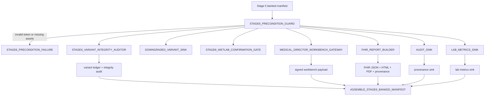

# Stage_6_Clinical_Reporting_Workbench_Gateway

Production-grade Stage 6 reporting gateway for zero-loss variant reconciliation, Medical Director workbench payloads, HL7 FHIR genomics report generation, and telemetry sink consolidation.

Current state:

- Stage 6 now includes explicit Stage 5 signature verification before any downstream reporting work is allowed to proceed.
- The stage enforces zero-loss candidate VUS reconciliation and fail-closed precondition validation.
- A release finalizer computes `Stage6_SHA256SUMS.txt` for final artifact integrity evidence.
- The Stage 6 FMEA suite now proves the critical negative cases, including signature mismatch and missing regulated metadata.

## Clinical Scope

Stage 6 consumes Stage 5 banked artifacts and enforces final fail-closed report governance before clinical handoff.

- Validates Stage 5 token and artifact completeness.
- Enforces zero-loss candidate VUS accounting.
- Builds Medical Director workbench payload and FHIR/HTML/PDF reporting outputs.
- Emits production telemetry sinks and Stage 6 manifest.

## September 2026 Interface Update

- Stage 6 now consumes Stage 5 manifests where every branch has explicit immutable status metadata.
- Stage 5 branch entries are expected to be either `COMPLETED` or `SKIPPED_BY_CLINICAL_DIRECTIVE` with auditable bypass policy fields.
- This preserves CAP/CLIA audit lineage when a clinical directive intentionally bypasses one or more Stage 5 branches.

## Architecture Flow



## Module Inventory

- `stage6_precondition_guard.nf`: validates Stage 5 contract completeness and token eligibility.
- `verify_stage5_signature.nf`: verifies the signed Stage 5 release payload against the canonical clinical bundle digest.
- `stage6_variant_integrity_auditor.nf`: enforces zero-loss candidate VUS reconciliation.
- `downgraded_variant_sink.nf`: emits downgraded/suppressed variant sink artifacts.
- `stage6_wetlab_confirmation_gate.nf`: materializes wet-lab confirmation queue artifacts.
- `medical_director_workbench_gateway.nf`: assembles review workbench payloads.
- `fhir_report_builder.nf`: builds FHIR, HTML, PDF, and provenance outputs.
- `audit_sink.nf`: consolidates audit payload lineage.
- `lab_metrics_sink.nf`: emits operational laboratory metrics.
- `stage6_release_finalizer.nf`: packages release artifact checksums into `Stage6_SHA256SUMS.txt`.
- `assemble_stage6_banked_manifest.nf`: renders the Stage 6 banked manifest.

## Inputs

Expected input:

- `--input ../Stage_5_Clinical_Annotation_PGx_Triage/tests/mini_control/samples_<sample_id>_banked_stage5.yaml`

Required fields and artifacts:

- `validation_token` containing `VALID_PASS|VARIANTS_HARMONIZED`
- Stage 5 clinical bundle (`clinical_bundle.tar.gz`)
- Stage 5 provenance JSON with signature block
- Stage 5 annotation/VUS/SF/PRS/PGx artifacts referenced in contract
- Stage 5 `branches.*.status` and bypass metadata for executed and skipped branch accounting

## Outputs

Published under Stage 6 output tree:

- `audit_and_qc/stage6/*.stage6_precondition_guard.json`
- `audit_and_qc/stage6/*.stage6_variant_integrity_audit.json`
- `audit_and_qc/stage6/*.stage6_variant_ledger.json`
- `reporting/fhir_genomics_v3.json`
- `reporting/clinical_report.html`
- `reporting/clinical_report.pdf`
- `reporting/*.provenance_audit.json`
- Stage 6 banked manifest
- `Stage6_SHA256SUMS.txt`

Formal audit evidence is also tracked in:

- `docs/STAGE6_REMEDIATION_CHANGELOG.md`
- `tests/fmea/stage6_fmea_summary.tsv`
- `stage6_audit_evidence.tar.gz`

## Zero-Loss Integrity Gate

`STAGE6_VARIANT_INTEGRITY_AUDITOR` reconciles:

- `candidate_vus_count`
- `upgraded_vus_count`
- `remaining_vus_count`

and fails closed when ledger reconciliation is violated:

- failure code: `STAGE6_VARIANT_LOSS_FAILURE`
- behavior: non-zero exit with explicit failure audit payload

## Medical Director Workbench Payload

`MEDICAL_DIRECTOR_WORKBENCH_GATEWAY` assembles review payloads using:

- Stage 5 signed provenance (`digital_signature` block)
- bundled digest lineage
- report sections and signoff metadata

The payload is designed for controlled manual clinical review and approval workflows.

## HL7 FHIR Genomics Reporting

`FHIR_REPORT_BUILDER` generates:

- `fhir_genomics_v3.json`
- `clinical_report.html`
- `clinical_report.pdf`
- `${sample_id}.provenance_audit.json`

FHIR payload composition includes:

- patient and diagnostic report resources
- stage integrity observations
- embedded digital signature provenance

## Dual Telemetry Sinks

Stage 6 consolidates two telemetry channels:

| Sink | Purpose |
|---|---|
| `provenance` (audit sink + provenance audit JSON) | cryptographic/report lineage and stage metadata traceability |
| `lab_metrics` | laboratory operational metrics and downstream observability |

## Execute

```bash
cd Stage_6_Clinical_Reporting_Workbench_Gateway
nextflow run main.nf \
  -profile docker \
  --input ../Stage_5_Clinical_Annotation_PGx_Triage/tests/mini_control/samples_<sample_id>_banked_stage5.yaml \
  --references ../control_plane/references.yaml \
  --thresholds ../control_plane/thresholds.yaml \
  --outdir tests/mini_control
```

## FMEA

```bash
python3 tests/fmea/run_stage6_fmea_suite.py
```

## Notes

- Stage 6 is the final fail-closed reporting boundary before clinical delivery.
- Signature lineage from Stage 5 is verified and propagated into both workbench and FHIR reporting artifacts.
- The current release state includes final checksum packaging and formal remediation evidence for audit replay.
